### 作者微信：grapro666 QQ：3642795578 (支持部署调试、支持代做毕设和论文)

### 接javaweb、python、小程序、H5、APP、各种管理系统、单片机、嵌入式等开发

### 选题+开题报告+任务书+程序定制+安装调试+论文+答辩ppt

**博客地址：
[https://blog.csdn.net/2303_76227485/article/details/128703398](https://blog.csdn.net/2303_76227485/article/details/128703398)**

**视频演示：
[https://space.bilibili.com/384537280](https://space.bilibili.com/384537280)**

**毕业设计所有选题地址：
[https://github.com/codegitpro/allProject](https://github.com/codegitpro/allProject)**

## Java+ssm个人记账管理系统610

## 一、系统介绍

用户：记账、收支管理、收支统计、收支分析、收支预算、心愿单、备忘录

管理员：用户管理、收支类别管理、新闻管理

## 二、所用技术

后端使用 ssm(spring+springmvc+mybatis)，前端使用 bootstrap 组件库配合完成开发。

## 三、环境介绍

基础环境 :IDEA/eclipse，maven3.x，JDK 1.8 ， Mysql 5.7

源码+数据库脚本 

所有项目以及源代码本人均调试运行无问题 可支持远程调试运行

## 四、页面截图

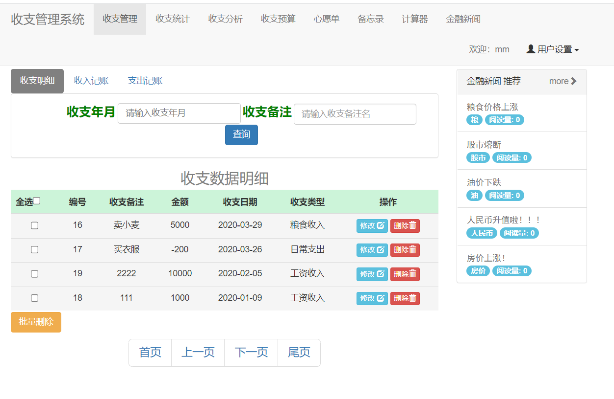

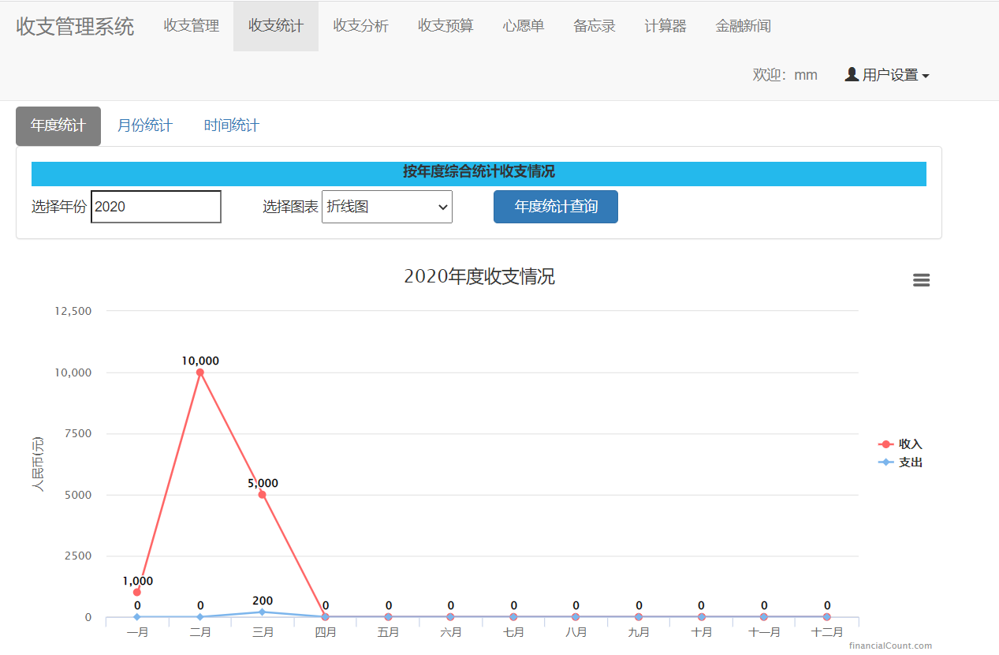

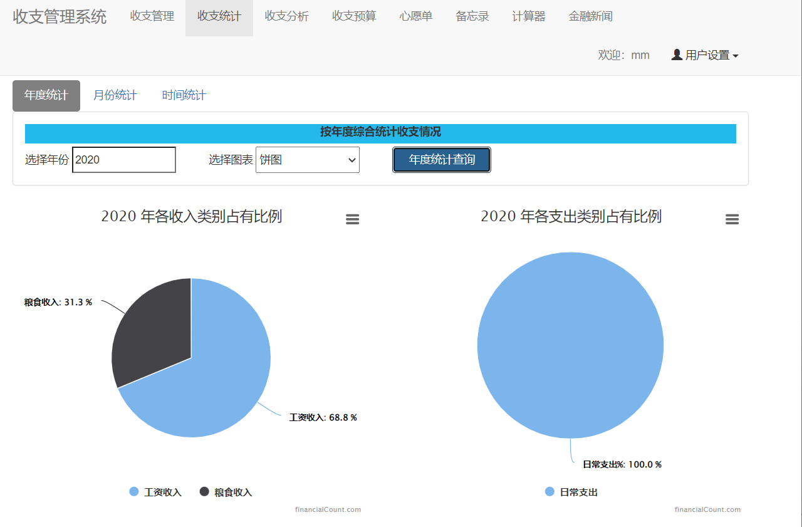

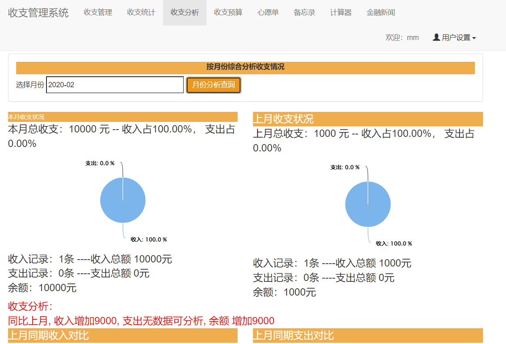

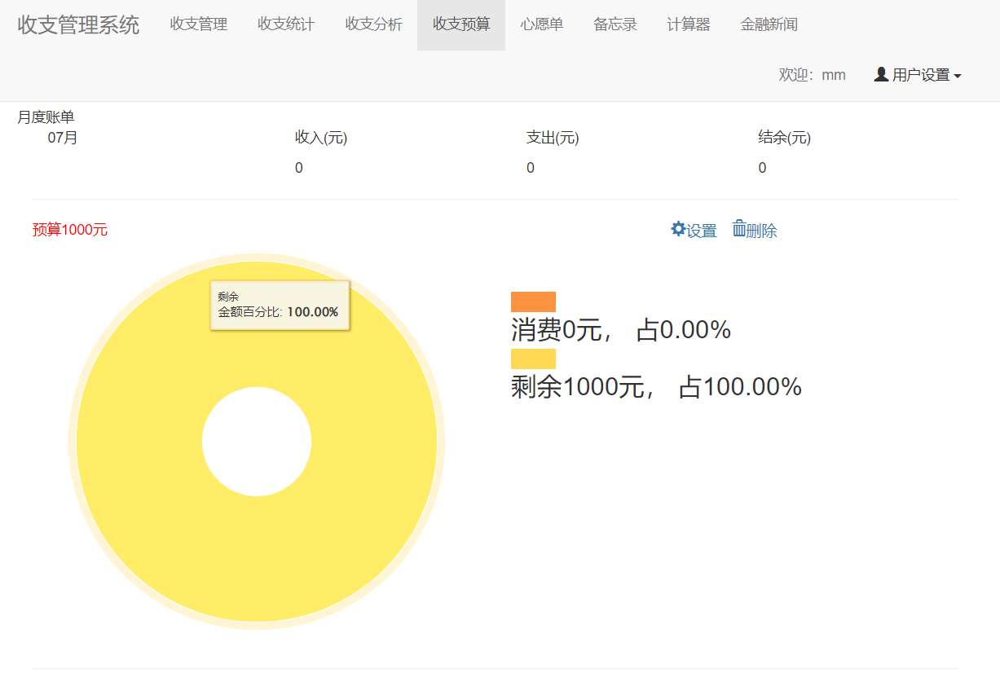

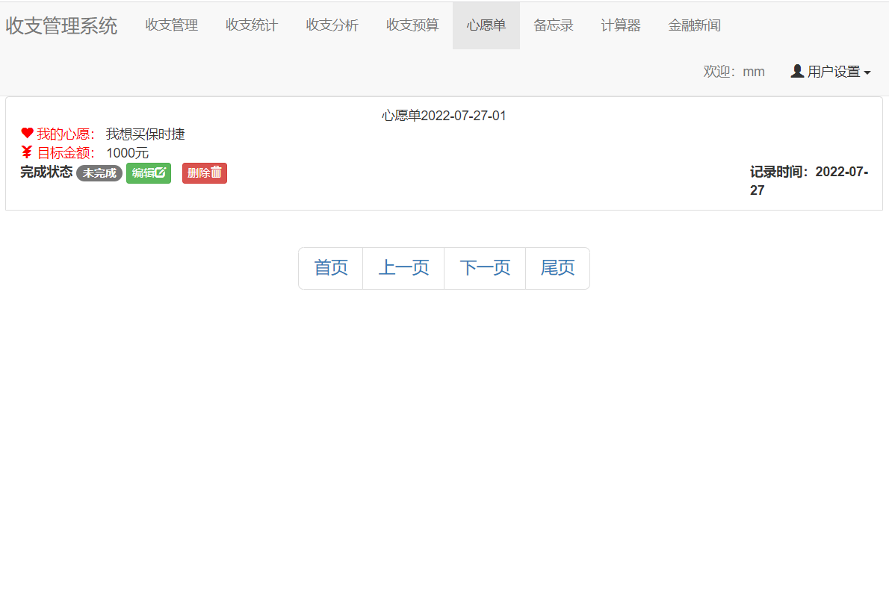

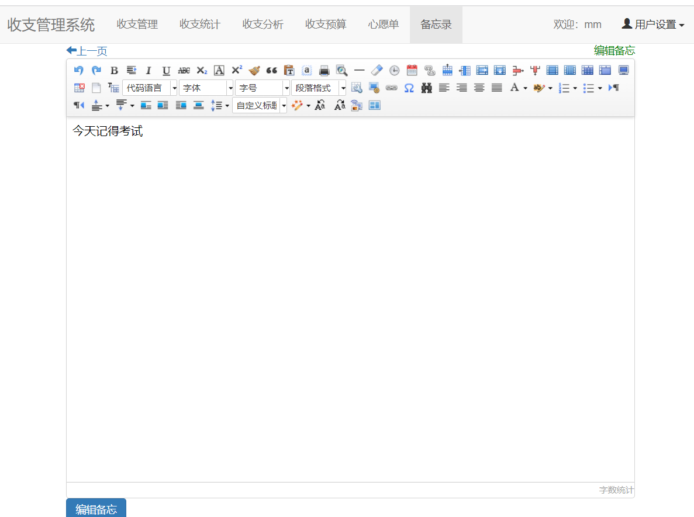

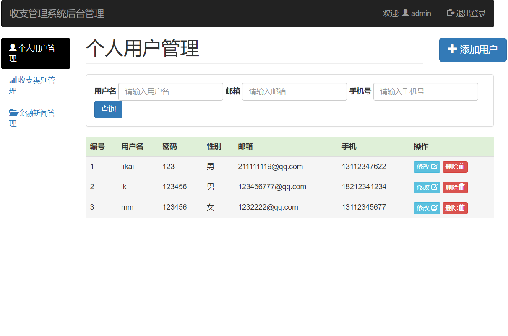

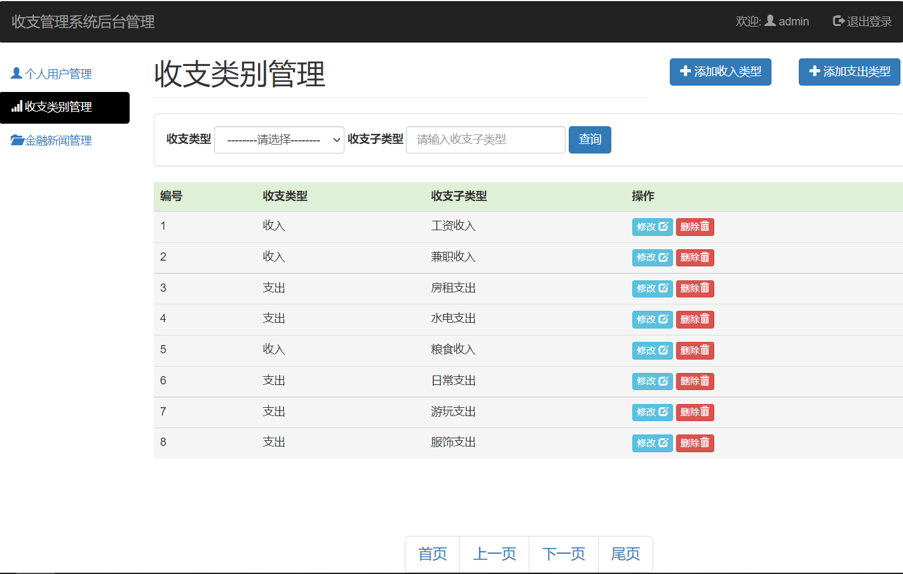

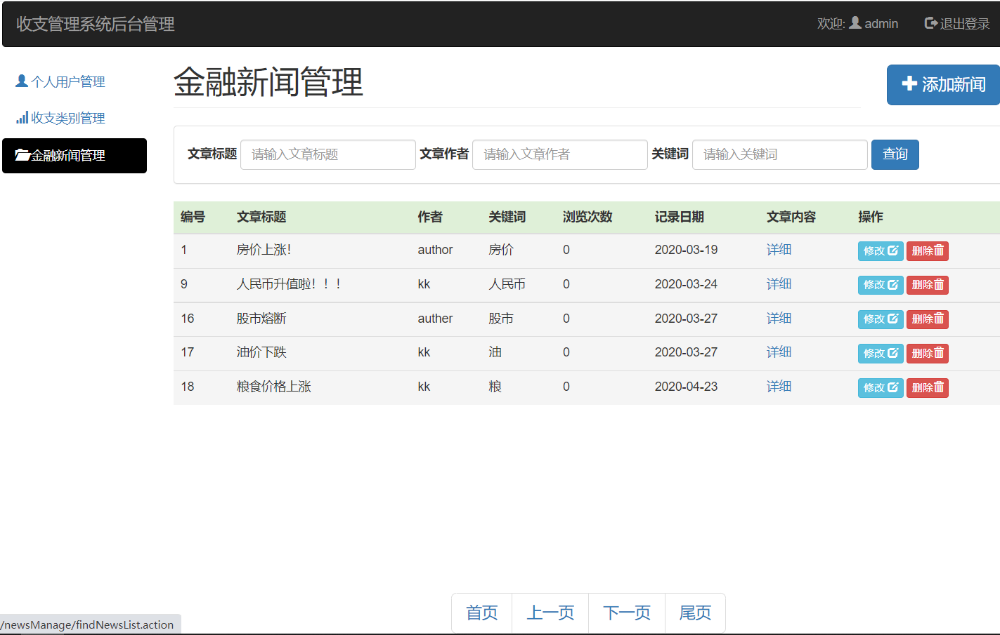

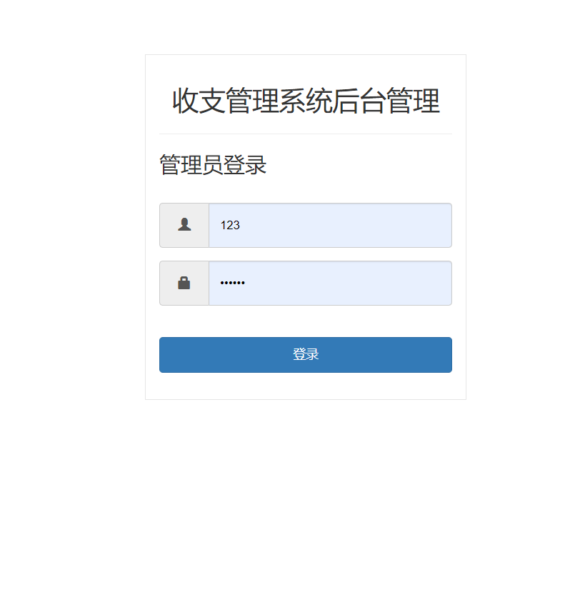

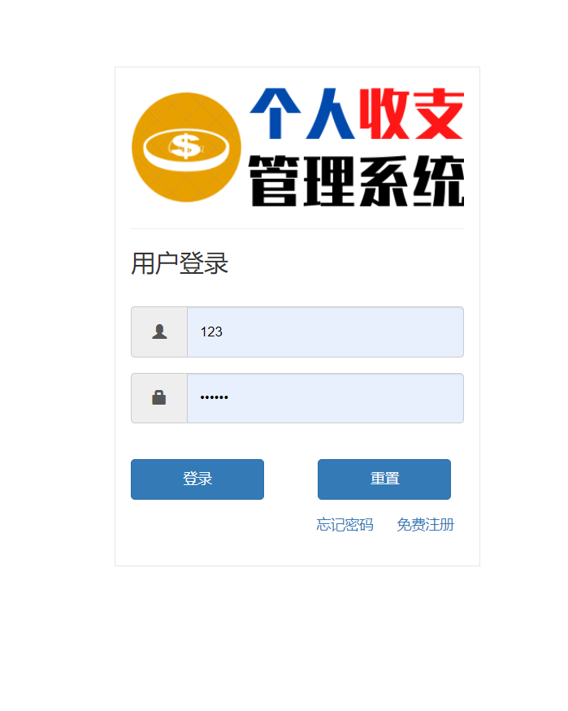

## 五、浏览地址

管理员登录：账号：admin  密码： 123456

http://localhost:8686/financialManage/userManage/logout.action

用户登录：账号：mm  密码： 123456

http://localhost:8686/financialManage/user/logout.action  
	
